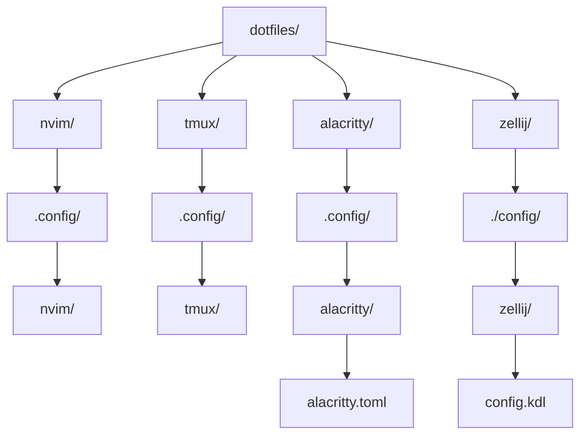

# Dotfiles

> [!NOTE]
> This's my personal configuration setup, the one that works on my machine. Check well if you are going to use it on yours


This is my personal dotfiles configs.
I don't like a complex systems for my personal use, so i try to make things simple and easy to mantain. The complex systems distract me a lot.

All i want is a terminal and clear minimalistic interface to interact with.

So the minimal here is a minimal configuration for:

- Neovim
- tmux
- Alacritty
- Zellij
- Fastfetch

Everything is managed by GNU Stow


        
Each directory is independent Stow package

---

## Dependencies needed:

```bash
brew install git stow neovim tmux lazygit ripgrep llvm
brew install --cask alacritty
```

Install Rust with **rustup**, then install the required components:

```bash
rustup update stable
rustup components add \
    rust-analyzer \
    rust-src \
    rustfmt \
    clippy
```

## Clonse repository

```bash
git clone <repo-url> "$HOME/dotfiles"
cd "$HOME/dotfiles"
```

## Create the symlinks

```bash
stow --verbose --target="$HOME" \
    nvim tmux alacritty
```
